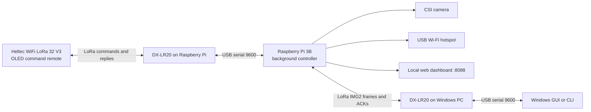

# DX-LR20 Raspberry Pi Control Center

> **Complete release:** This repository includes the Pi controller, Pi service,
> installers, Windows GUI, Windows CLI, Heltec sketch, dashboard installer,
> hotspot support, and full documentation. Start with
> [`START_HERE.md`](START_HERE.md). A file-by-file list is available in
> [`REQUIRED_FILES.md`](REQUIRED_FILES.md), and GitHub upload instructions are
> in [`UPLOAD_TO_GITHUB.md`](UPLOAD_TO_GITHUB.md).

A long-range control, telemetry, hotspot, dashboard, and reliable image-transfer system built around a **Raspberry Pi 3 Model B**, **DX-LR20 LoRa modules**, a **Heltec WiFi LoRa 32 V3**, and a **Windows control application**.

> [!IMPORTANT]
> This repository documents the current combined release. The Pi and PC GUI are based on Control Center **v3.2**, and the handheld remote uses the newer Heltec **v3.3** grouped-menu and battery-display sketch.

## What it does

- Sends approved system and camera commands over LoRa.
- Displays Pi status on a Windows dashboard and the Heltec OLED.
- Captures images from the Raspberry Pi CSI camera port.
- Transfers JPEG images with per-chunk CRC32, final SHA-256 verification, ACK/NACK, retries, pause, and resume.
- Runs a USB Wi-Fi dongle as a hotspot while leaving the Pi's built-in Wi-Fi available for the normal network.
- Hosts a local system and speed dashboard accessible over the hotspot.
- Provides both a graphical Windows app and a terminal-only Windows client.
- Starts the Pi controller automatically through `systemd`.

## Architecture

## Current software set

| Component | Current file | Role |
|---|---|---|
| Raspberry Pi | `software/pi/dxlr20_pi3b_reliable.py` | Command handler, CSI capture, system controls, IMG2 transmitter |
| Pi service | `software/pi/dxlr20-pi3b-reliable.service` | Automatic boot and restart |
| Windows GUI | `software/pc-gui/dxlr20_control_center.py` | Clean dashboard, controls, image receiver |
| Windows CLI | `software/pc-cli/dxlr20_control_cli.py` | Terminal-only controls and image receiver |
| Heltec | `software/heltec/Heltec_V3_Pi3B_Control_Remote_v3_3_Battery.ino` | Grouped handheld menu and local Li-Po estimate |
| Web dashboard | `software/dashboard/install_rpi_speed_dashboard.sh` | Installs `rpi-speed-dashboard.service` |
| Hotspot access | `software/dashboard/enable_dashboard_over_hotspot.sh` | Exposes dashboard through the USB hotspot |

## Quick start

1. Read [Hardware](docs/setup/hardware.md) and [Radio configuration](docs/setup/radio.md).
2. Flash and configure the Pi using [Operating system setup](docs/setup/os.md).
3. Install the Pi controller using [Raspberry Pi installation](docs/setup/raspberry-pi.md).
4. Upload the [Heltec remote](docs/components/heltec.md).
5. Run either the [Windows GUI](docs/components/windows-gui.md) or [Windows CLI](docs/components/windows-cli.md).
6. Install the optional [web dashboard and hotspot access](docs/components/web-dashboard.md).
7. Use [First test](docs/setup/first-test.md) to verify commands and image transfer.

## Documentation

- [Project overview](docs/index.md)
- [Hardware](docs/setup/hardware.md)
- [Operating system](docs/setup/os.md)
- [Radio settings](docs/setup/radio.md)
- [Raspberry Pi installation](docs/setup/raspberry-pi.md)
- [Windows GUI](docs/components/windows-gui.md)
- [Windows CLI](docs/components/windows-cli.md)
- [Heltec remote](docs/components/heltec.md)
- [Web dashboard](docs/components/web-dashboard.md)
- [Command reference](docs/reference/commands.md)
- [IMG2 protocol](docs/reference/img2-protocol.md)
- [Configuration](docs/reference/configuration.md)
- [Troubleshooting](docs/operations/troubleshooting.md)
- [Security and safety](docs/operations/security.md)
- [Version compatibility](docs/reference/versions.md)

## Important limitations

- The radio link is half-duplex and low bandwidth. High-quality images can take a long time.
- The current Pi receiver executes a fixed `PI:*` command whitelist. It does **not** provide an unrestricted remote shell or unrestricted `sudo`.
- PC software sends no startup heartbeat. During image transfer it sends only required IMG2 ACK/NACK traffic.
- The hotspot requires a USB Wi-Fi adapter that supports access-point mode.
- The Heltec battery percentage is an estimate and may vary by board revision, battery load, and charging state.

## External documentation

- [Raspberry Pi getting started](https://www.raspberrypi.com/documentation/computers/getting-started.html)
- [Raspberry Pi camera software](https://www.raspberrypi.com/documentation/computers/camera_software.html)
- [Heltec WiFi LoRa 32 documentation](https://docs.heltec.org/en/node/esp32/wifi_lora_32/index.html)
- [Heltec hardware update log](https://docs.heltec.org/en/node/esp32/wifi_lora_32/hardware_update_log.html)

## Repository status

This is a project-specific build and documentation set. Test disruptive controls such as network restart, SSH disable, reboot, and shutdown locally before relying on them remotely.
